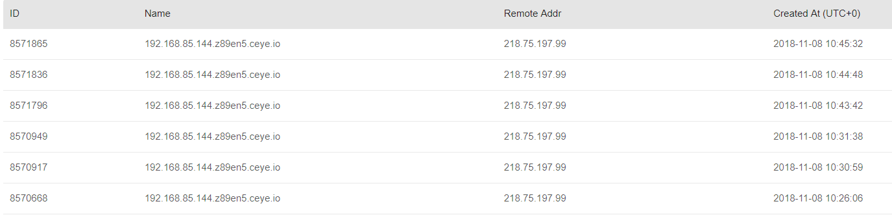

# weblogic-scan
weblogic 漏洞扫描工具
~~妄想~~试图weblogic一把梭  
目前检测的功能

- [x] console 页面探测 & 弱口令扫描
- [x] uuid页面的SSRF
- [x] CVE-2017-10271 wls-wsat页面的反序列化
- [x] CVE-2018-2628 反序列化

后期可以的话还会继续加功能的，主要是一些反序列化的poc真的不好写，我也不咋会..

# USE

**使用前请先填写`config.py`中的`server`参数**  
推荐配合`http://ceye.io`之类的工具使用，server格式为`http://xxx.ceye.io`

使用方式比较简单，目前支持两种模式

1、扫描url.txt中的所有url

```
python3 weblogic-scan
```

2、扫描单一的url

```
python3 weblogic-scan 127.0.0.1:7001
```


console弱口令和CVE-2018-2628的扫描结果会直接在控制台中输出。

uuid页面的SSRF以及wls-wsat反序列化会在server服务器中留下日志文件。  
会在域名前带上受影响机子的地址，这样扫描多个地址的时候方便做区分。



# prepare

## ENV

- version: python3
- expand : requests

## config.py

- timeout: 
  ​	自定义timeout的时间，包括requests和socket的timeout
- **server**(没有默认值，务必填写): 
  由于一些exp发送后具体有没有成功需要看服务器是否有数据返回
  需要一个服务器来接受这种数据，例如`http://ceye.io`
  攻击成功会在dns记录以及http的log部分留下数据

## url.txt

支持如下几种格式的url

- 127.0.0.1
- 127.0.0.1:7001
- http://127.0.0.1
- http://127.0.0.1:7001
- https://127.0.0.1
- http://127.0.0.1:7001

不填写端口默认端口为80，https起头的默认端口为443


